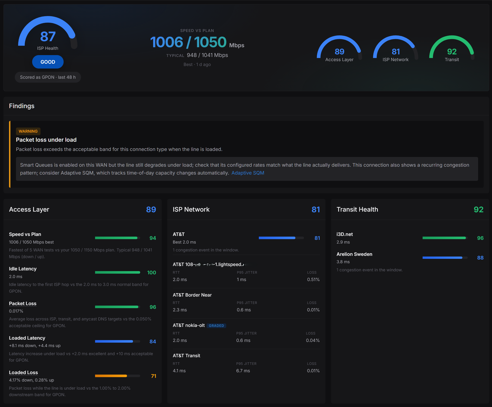
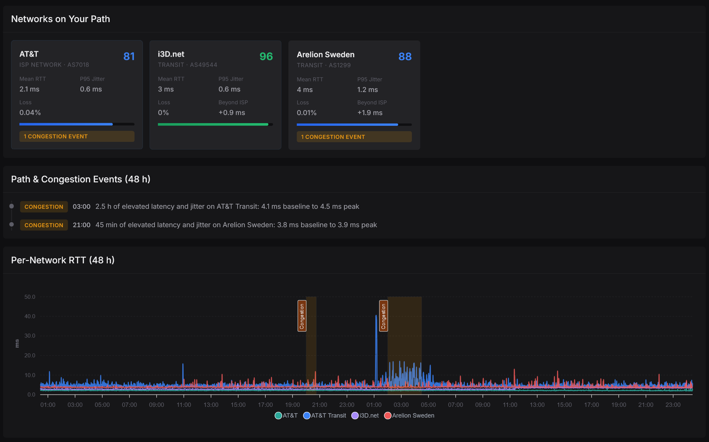
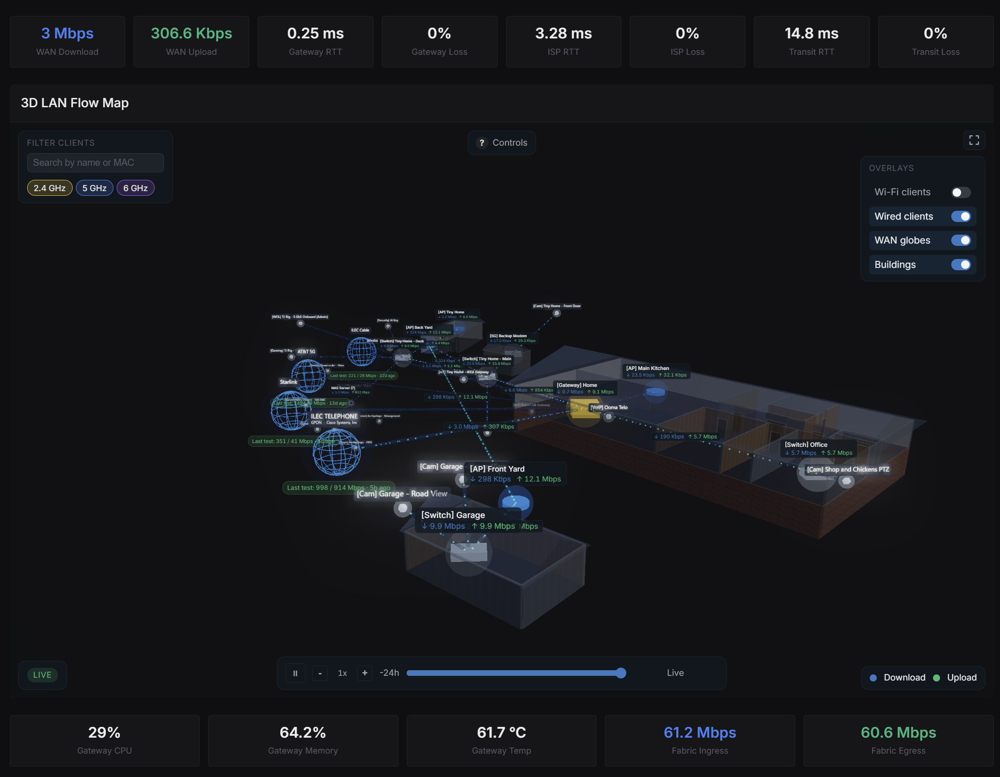
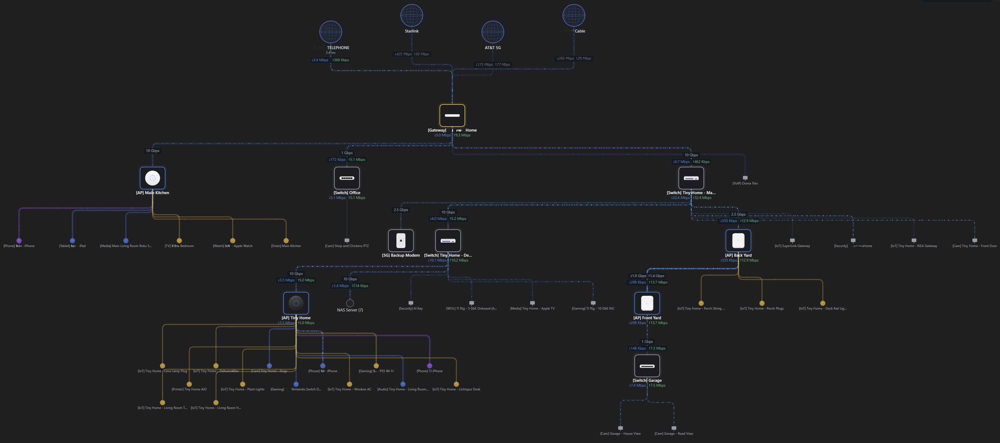

<p align="center">
  
</p>

# Network Optimizer for UniFi

[](https://github.com/Ozark-Connect/NetworkOptimizer/releases)
[](https://github.com/orgs/Ozark-Connect/packages?repo_name=NetworkOptimizer)
[](https://github.com/Ozark-Connect/NetworkOptimizer/releases)
[](https://github.com/Ozark-Connect/NetworkOptimizer/commits)
[](https://github.com/Ozark-Connect/NetworkOptimizer/stargazers)
[](https://github.com/Ozark-Connect/NetworkOptimizer/blob/main/LICENSE)

## THANK YOU to all of my Sponsors

Genuinely, thank you so much to everybody for taking the time to use Network Optimizer and have it find a place on your network(s). It really means a lot to receive all of the bug reports, feature requests, feedback, support, and donations from everybody. Totally a whole new experience from writing code in a dayjob, and it greatly motivates me to keep on going!

## Multi-Site Support Is in Development

Multi-site support is almost ready! Please see this thread if you'd like to help test it: https://github.com/Ozark-Connect/NetworkOptimizer/discussions/954

**Licensing and firewalls:** Personal use on up to 3 sites is free and never contacts a license server - nothing to configure, nothing phones home. Running more than 3 sites requires a license key (Settings > Application > Licensing), and activating or renewing a key makes an outbound HTTPS request to `licensing.ozarkconnect.net`. If activation reports the license server as unreachable, check that your outbound firewall rules allow HTTPS (443) to that hostname. A license server outage never disables your sites - entitlements are cached and verified locally, and perpetual licenses stop phoning home entirely after a one-time confirmation.

## New: ISP Health

All that monitoring data has to add up to something. ISP Health is the part of Monitoring that takes everything Network Optimizer is already collecting - SNMP device health, the latency and packet loss probes, WAN throughput, and the hops your Upstream Path Discovery mapped - and brings it full circle into a single honest score for how well your internet connection is actually performing. No new agents and no extra probes: it's the same data you're already storing, read back over a trailing 48-hour window and graded.

Here's what makes the score mean something: it's technology-aware. A 9 ms idle latency is perfectly healthy on DOCSIS and a red flag on GPON, so ISP Health anchors its thresholds to the access technology you picked during Upstream Discovery (GPON, XGS-PON, DOCSIS, DSL, fixed wireless, cellular, Starlink, and more). The score splits into equal thirds: your Access Layer (idle and loaded latency, packet loss, and demonstrated speed against the plan you've configured in UniFi Network), your ISP's own network, and the Transit networks your traffic crosses to reach the rest of the internet. Every factor shows its own contribution, so a low score tells you exactly where the problem lives instead of just that one exists.



The transit grading is where it gets useful. ISP Health grades each ASN in your path on its own - latency stability, jitter, loss, and congestion - and it watches for two things UniFi will never surface. Congestion events are sustained latency and jitter under load, the classic signature of an oversubscribed link choking up in the evenings. Path shifts are a sustained step in your RTT that means your traffic got rerouted onto different infrastructure; those are flagged as informational, since a BGP change isn't necessarily a problem you need to chase. And when loaded latency (AKA bufferbloat) or packet loss crosses the line for your connection type, it'll point you at Smart Queues, or recommend Adaptive SQM when it spots a recurring time-of-day congestion pattern.



Coming Soon: Multi-WAN support for both Monitoring and ISP Health. The per-WAN stats are already being collected - today the scoring and dashboards grade your primary connection, with secondary WANs next on the list.

## New: Access Network Monitoring

Track signal quality on your cable modem, fiber ONT, and cellular modems over time - the same InfluxDB time-series charting as the rest of your network monitoring data. Instead of logging into each device's admin page to spot-check levels, everything is polled automatically and charted with the same time range controls, filter badges, and dashboard panels as your LAN and WAN metrics.

**Cable Modem (DOCSIS)** - Downstream/upstream power levels, SNR, and FEC error rates (correctable and uncorrectable) with per-channel charting. Supports Netgear CM (CM600, CM700, CM1000, CM1200), ARRIS Surfboard (SB8200, SB6183, S33/S34), Motorola (MB8611, MB8600, MB7621), and Xfinitiy / Cox (XB8 / XB10 and CGM4981).

**Fiber ONT** - RX/TX optical power, temperature, voltage, and bias current for external and SFP ONTs. Supports AT&T residential gateways (BGW320, BGW210), Quantum Q1000K, Realtek-based GPON sticks (ODI DFP-34X-2C2, V-SOL V2801F, T&W TWCGPON657), and 8311 community firmware sticks (WAS-110, PRX126, Nokia G-010S-P). SFP-based ONT monitoring (modules plugged into your gateway that expose DDM optical data) is part of the Network Monitoring feature below.

**Cellular Modems** - RSRP, RSRQ, SNR, and Signal Quality charted over time with per-band, per-device series and filter badges. Supports Ubiquiti (U-LTE, U5G-Max, U5G-Backup), Netgear Nighthawk modems/hotspots, and GL-iNet/Quectel modems/routers. Dual-connectivity mode tracks LTE and NR5G bands separately for NSA setups.

## New: Self-Hosted Network Monitoring

Full time-series network monitoring that runs entirely on your hardware. SNMP polling feeds InfluxDB for interface counters, device health (CPU, memory, temperature, uptime), latency probes, SFP optical levels, and WiFi client stats. Everything is stored locally with configurable retention, and a setup wizard handles InfluxDB bucket and token provisioning so you're not hand-editing config files. And since it's plain InfluxDB under the hood, you can bring your own Grafana for custom dashboards if you want to go further.

The Live View gives you two real-time topology maps. The 3D map is a Three.js visualization with bi-directional particle-flow traffic for all LAN traffic (not just WAN-bound traffic like in UniFi Network), WASD camera navigation, and double-click on any client to jump to their performance dashboard. The 2D map is a hierarchical flow diagram that's easier to read at a glance, showing the same live throughput rates, device health badges, and client connections on a canvas you can pan and zoom. Both support historic playback: scrub backward through your monitoring data to see what your network looked like at any point, with full playback controls and adjustable speed.

Latency and packet loss charting covers four target categories (LAN fabric, ISP access, transit, and internet services) with per-target filter badges, time range presets from 15 minutes to 30 days, and sub-15ms query performance. Device health charts track temperature, CPU, and memory for all your devices on one screen; in UniFi Network those stats only exist in each device's individual Insights view, with no single pane of glass for hardware health. SFP/ONT optical monitoring shows live RX/TX power, temperature, voltage, and bias current for PON modules, with automatic GPON vs XGS-PON detection.

Upstream Path Discovery uses automated traceroute (ICMP and UDP probes) to map your ISP's access infrastructure, transit networks, and internet service endpoints. It identifies your OLT/CMTS, ISP edge routers, and transit ASNs with full latency and loss charting per hop category. Both maps include a WAN node for each internet connection showing live RTT, current throughput, latest speed test results, and ISP expected speeds.

### How readings are measured

Where Network Optimizer and UniFi Network show different numbers, it's because we read the raw sensors and count the standard way:

- **CPU temperature** is the SoC die sensor read directly over SNMP (LM-SENSORS `temp-cpu`). It responds within seconds to load. UniFi Network appears to report a damped board probe used for fan control, which reads several degrees lower and lags behind load changes.
- **Memory** is real used memory excluding Linux page cache, the same number `htop` shows. Linux deliberately fills idle RAM with cache, so counting cache as "used" (as UniFi Network does on some models) makes a healthy gateway look like it's leaking memory.
- **Switch temperatures** fall back to the UniFi API where the SNMP tree exposes no thermal data.

For the full changelog, see the [v1.17.0 release notes](https://github.com/Ozark-Connect/NetworkOptimizer/releases/tag/v1.17.0) and subsequent patch releases.





## New: API Key auth to console

Connect to your UniFi Console using an API key instead of username and password. Generated in UniFi Network under Integrations -> Create New API Key. The key is encrypted at rest and never exposed in logs or the UI. Useful for sites where you don't necessarily want to create a Local Admin, or when you're using UniFi Fabrics which no longer lets you create Local Admin users.

## New: WAN Steering

UniFi makes you choose between WAN Failover and Load Balancing, and its Policy-Based Routes can only match by destination IP or domain - not port or protocol. WAN Steering removes both limitations. Keep your primary WAN for responsive, latency-sensitive traffic by default, and selectively load balance bulk traffic - Steam downloads, OS updates, Xbox downloads - across your secondary connections so they're not just sitting idle waiting for a failover event.

Route by source, destination, port, or protocol with full load balancing support. Pin gaming traffic to your fastest link while HTTP/HTTPS flows get split 50/50 across all your WANs. Health-check failover, automatic rule recovery after gateway reprovisioning, and zero impact to gateway performance.

## New: HTTPS Reverse Proxy

Enable HTTPS with automatic Let's Encrypt certificates using the included [Traefik reverse proxy](https://github.com/Ozark-Connect/NetworkOptimizer-Proxy). It forces HTTP/1.1 for speed tests (HTTP/2 multiplexing skews results) while keeping HTTP/2 for the main app. Windows MSI users can enable Traefik as an optional feature during install. HTTPS also unlocks GPS-based tagging on your self-hosted Speed Test and Signal walk test data, since browsers require a secure context for location access.

## New: Threat Intelligence

Your UniFi gateway's IPS is blocking threats all day long, but the UniFi Console buries this data in a flat event log with no context. Threat Intelligence pulls those IPS events and actually analyzes them: who's attacking you, where they're coming from, what they're after, and whether it's random noise or a coordinated effort.

The exposure analysis is where it gets useful. It cross-references your port forwards with actual threat data, so you can see which of your exposed services are getting hammered and from where. Attack sequence detection watches for the same source IP progressing through kill chain stages (reconnaissance to exploitation to post-exploitation) and flags the ones that look like real campaigns rather than drive-by scanning. Geographic and ASN breakdowns show you which countries and networks are generating the most traffic against your infrastructure.

CrowdSec CTI integration adds reputation scoring and MITRE ATT&CK classification to each source IP, so you're not just looking at raw events - you know whether that IP has a history of malicious activity across the broader internet.

## New: Alerts & Scheduling

Set up automated speed tests and security audits on a schedule, and get notified when something goes wrong. The scheduling engine handles recurring WAN and LAN speed tests with configurable frequency and time windows, plus periodic security audits that track your score over time.

Alert rules watch for the things that matter: audit score drops, WAN speed degradation, LAN speed regression against recent baselines, IPS attack chains reaching active exploitation, and scheduled task failures. Each rule has configurable severity thresholds and cooldown periods so you're not drowning in noise. Threshold-based rules (like "alert me when WAN speed drops 40% below the recent average") let you tune sensitivity to your environment.

Delivery channels support email (SMTP with STARTTLS), Discord, Slack, Microsoft Teams, and generic webhooks. Low-priority alerts can be set to digest-only mode so they get bundled into a daily summary instead of pinging you every time your neighbor microwaves lunch and your 2.4 GHz channel gets congested.
## New: Client Performance

A per-device analytics dashboard for any client on your network. Pick a device and get live signal monitoring, speed test history with download/upload trends, latency and jitter charts, network path visualization showing every hop and bottleneck link, and a connection timeline tracking AP roams and disconnects. Walk around with the page open on your phone (over HTTPS) and it builds a GPS-based signal heatmap of your actual coverage. Three tabs - Speed, Signal, and Connection - give you everything you need to troubleshoot why a device is slow or unstable.

---

You've set up VLANs, configured firewall rules, maybe even deployed a Pi-hole for DNS filtering. The UniFi controller gives you all this power, but it never actually tells you whether your configuration is any good. Are your firewall rules doing what you think they're doing? Is that IoT VLAN actually isolated, or did you miss something? When a device bypasses your DNS settings and phones home directly, would you even know?

Network Optimizer answers those questions. It connects to your UniFi controller, analyzes your configuration, and tells you what's working, what's broken, and what you should fix. No more guessing.

## Main Features

### Wi-Fi Optimizer & Signal Map

Site health scoring, RF environment analysis, client stats, roaming tracking, band steering, and airtime fairness across twelve analysis tabs. The Channel Recommendation engine models pairwise AP interference using signal propagation, live RF scan data, and triangulated neighbor networks, then factors in historical channel stress (utilization, interference, TX retries) to find the lowest-interference channel assignment across your entire network. It respects mesh uplink constraints, DFS preferences, and regulatory channel availability, and validates every recommended move against improvement thresholds so it won’t suggest changes that aren’t worth the disruption.

On the client side, you get a sortable, searchable table view with online/offline filtering, per-client signal and roaming history, and band-segmented Wi-Fi generation breakdowns showing exactly where your airtime is going. Environmental correlation heatmaps surface interference patterns by time of day and day of week, and every recommendation includes the specific UniFi Network UI navigation path to apply the change.

Signal Map lets you draw your building layout, place APs, and see a real-time RF propagation heatmap. Supports wall materials (drywall, concrete, glass, etc.), multi-floor buildings with cross-floor signal propagation, and per-AP antenna patterns pulled from your controller. Simulate TX power and antenna mode changes to see how they’d affect coverage before touching your actual config. Add planned APs to simulate coverage before buying or mounting hardware.

### Security Auditing

The audit engine runs 83 security checks across five categories and scores your network 0-100. This isn't a checkbox audit that just confirms you have a firewall; it actually analyzes what your rules do and whether they're doing it correctly.

Firewall analysis catches the subtle stuff: rules that shadow each other, allow rules that subvert your deny rules, allow rules that punch holes through your network isolation. VLAN security checks whether your IoT devices and cameras are actually on the networks you intended (using UniFi fingerprints, MAC OUI lookup, and port naming patterns). DNS security validates your DoH configuration, checks for bypass routes (including DoT, DoQ, and HTTP/3 DoH bypass), and verifies that your WAN interface DNS settings match what you configured. Port security looks at MAC restrictions, port isolation, and whether you've left unused ports enabled. UPnP analysis flags enabled UPnP, exposed privileged ports, and static port forwards you may have forgotten about.

You get a score, a breakdown by severity (critical, recommended, informational), and specific recommendations for each issue. Dismiss false positives if your setup is intentional, export PDF reports for documentation, track your score over time.

### WAN Steering

UniFi's WAN Failover keeps secondary connections idle until your primary goes down. Load Balancing splits everything across all WANs but gives you no control over what goes where. WAN Steering lets you have both: keep your primary WAN as the default for latency-sensitive traffic, and selectively load balance bulk traffic across your secondary connections with full port and protocol matching.

Define traffic classes by source, destination, port, or protocol, assign them to specific WANs or load balance across multiple WANs with configurable weight. A lightweight Go binary on your gateway inserts rules above UniFi's routing table, watches for WAN state changes and reprovisioning events, and recovers automatically. Health-check failover still works as expected - if a WAN goes down, traffic redistributes to healthy links.

### Adaptive SQM

If you're on cable, DSL, or cellular, you know bufferbloat. That lag spike when someone starts a download or joins a video call. SQM fixes it, but setting the bandwidth limits correctly is a guessing game; too high and SQM can't shape traffic effectively, too low and you're leaving speed on the table.

Network Optimizer handles this automatically. It supports dual-WAN with independent configuration per interface, connection profiles tuned for DOCSIS, fiber, wireless, Starlink, and cellular (each has different characteristics that matter). Scheduled speedtests adjust your rates based on actual measured performance. Latency monitoring backs off when congestion appears. One-click deployment pushes the configuration to your UDM or UCG gateway with persistence through reboots.

### WAN Speed Testing

Test your internet connection speed directly from the server. Measures download, upload, latency, loaded latency (bufferbloat detection), and jitter with full history and per-WAN connection tracking. Results are plotted in time-series charts filterable by connection, so you can compare providers and track performance over time across multi-WAN setups.

Also includes a standalone OpenSpeedTest server you can host on a VPS or remote machine, so you can run WAN speed tests against your own private infrastructure instead of relying on third-party speed test services. Configure it in Settings and get a ready-to-copy deploy command - see [External WAN Speed Test Server](docker/DEPLOYMENT.md#external-wan-speed-test-server-optional) in the deployment guide. If you're that kind of nerd.

### LAN Speed Testing

Ever wonder if that new switch is actually delivering 10 gigabit speeds? Or whether the cable run to the shop is the bottleneck?

Network Optimizer runs iperf3 tests between your gateway and network devices, auto-discovers UniFi equipment from your controller, supports custom devices with per-device SSH credentials, auto indexes iperf3 results from tests initiated by other devices against the built in server (if enabled), and correlates results with hop count and infrastructure path, with detailed Wi-Fi stats and link speeds recorded along with UniFi firmware versions.

Test history lets you track performance over time with these relevant data in order to identify and characterize any changes to performance.


### Client Speed Testing

Test LAN speeds from any device without SSH access. Open a browser on your phone, tablet, or laptop and run a speed test; results are automatically recorded with device identification. For CLI users, the bundled iperf3 server accepts client connections and logs results. See [Client Speed Testing](docker/DEPLOYMENT.md#client-speed-testing-optional) in the deployment guide.


With HTTPS enabled, browser tests can collect location data (with permission) to build a Speed / Coverage Map showing real-world performance across your property or campus.


### Cellular Modem Monitoring

If you're running a U-LTE or U5G-Max for backup (or primary) connectivity, you can monitor signal quality from the dashboard: RSRP, RSRQ, SNR, cell tower info, and connection status. Supports multiple modems with easy navigation between them.


### UPnP Inspector

Ever wonder what ports your network is actually exposing to the internet? Your Xbox, Plex server, and smart home devices are all punching holes through your firewall via UPnP, and UniFi doesn't make it easy to see what's going on.

The UPnP Inspector puts it all in one place: every dynamic UPnP mapping and static port forward, grouped by device, with color-coded status so you can see at a glance what's active, what's idle, and what's about to expire. Add notes to remember what each mapping is for (because you will forget). Search and filter when you're hunting for that one port that's causing problems.

## Requirements

- UniFi Console (aka Controller) - UDM, UCG, UDR, CloudKey, or self-hosted UniFi Network Server
- Network access to your UniFi Console API (HTTPS)

Most features work with just API access. SSH is only needed for speed testing and Adaptive SQM:

| Feature | SSH needed? |
|---------|------------|
| Security Audit | No |
| Config Optimizer | No, but Gateway SSH required for upcoming features |
| Wi-Fi Optimizer | No |
| Threat Intelligence | No |
| Alerts & Scheduling | No (schedules speed tests that may require SSH) |
| Client Speed Test | No |
| WAN Speed Test | No, but gateway-based requires Gateway SSH |
| LAN Speed Test | Yes - Gateway SSH and/or Device SSH |
| WAN Steering | Yes - Gateway SSH |
| Adaptive SQM | Yes - Gateway SSH |

To enable SSH, see [SSH Configuration](docker/DEPLOYMENT.md#unifi-ssh-configuration) in the Deployment Guide. SSH must be configured via the UniFi web interface (not the mobile app).

## Installation

| Platform | Method | Guide |
|----------|--------|-------|
| Linux Server | Docker (recommended) | [Deployment Guide](docker/DEPLOYMENT.md#1-linux--docker-recommended) |
| Proxmox VE | LXC one-liner | [Proxmox Guide](scripts/proxmox/README.md) |
| Synology/QNAP/Unraid | Docker | [NAS Deployment](docker/DEPLOYMENT.md#3-nas-deployment-docker) |
| Home Assistant | Add-ons | [Home Assistant](docker/DEPLOYMENT.md#5-home-assistant) |
| Windows | Installer (recommended) | [Download from Releases](https://github.com/Ozark-Connect/NetworkOptimizer/releases) |
| macOS | Native (best performance) | [macOS Installation](docs/MACOS-INSTALLATION.md) |
| Linux | Native (no Docker) | [Linux Native](docker/NATIVE-DEPLOYMENT.md#linux-deployment) |

Docker Desktop on macOS and Windows limits network throughput for speed testing. For accurate multi-gigabit measurements, use native deployment.

### HTTPS Reverse Proxy

For HTTPS with automatic Let's Encrypt certificates, use [NetworkOptimizer-Proxy](https://github.com/Ozark-Connect/NetworkOptimizer-Proxy) - a Traefik setup that forces HTTP/1.1 for speed tests (HTTP/2 multiplexing skews results) while keeping HTTP/2 for the main app. Proxmox LXC and Windows MSI users can enable Traefik as an optional feature during install. This also allows for simpler enablement of GPS-based tagging on your self-hosted Speed Test and Signal walk test data as browsers require HTTPS for location data to flow.

### Quick Start (Linux Docker)

**Option A: Pull Docker Image (Recommended)**

```bash
mkdir network-optimizer && cd network-optimizer
curl -o docker-compose.yml https://raw.githubusercontent.com/Ozark-Connect/NetworkOptimizer/main/docker/docker-compose.prod.yml
curl -O https://raw.githubusercontent.com/Ozark-Connect/NetworkOptimizer/main/docker/.env.example
cp .env.example .env
docker compose up -d

# Check logs for the auto-generated admin password
docker logs network-optimizer 2>&1 | grep -A5 "AUTO-GENERATED"
```

**Option B: Build from Source**

```bash
git clone https://github.com/Ozark-Connect/NetworkOptimizer.git
cd NetworkOptimizer/docker
cp .env.example .env
docker compose build
docker compose up -d

# Check logs for the auto-generated admin password
docker logs network-optimizer 2>&1 | grep -A5 "AUTO-GENERATED"
```

Open http://localhost:8042

### Quick Start (Proxmox)

```bash
bash -c "$(wget -qLO - https://raw.githubusercontent.com/Ozark-Connect/NetworkOptimizer/main/scripts/proxmox/install.sh)"
```

### First Run

1. Go to Settings and enter your UniFi controller URL
2. Create a **Local Access Only** account on your controller (Ubiquiti SSO won't work):
   - Quick: Super Admin role
   - Restricted: Network View Only, Protect View Only, User Management None
   - See the in-app setup guide or [detailed instructions](docker/DEPLOYMENT.md#unifi-account)
3. Click Connect to authenticate
4. Navigate to Audit to run your first security scan

## Project Structure

```
src/
├── NetworkOptimizer.Web         # Blazor web UI
├── NetworkOptimizer.Alerts      # Alerts & Scheduling engine
├── NetworkOptimizer.Audit       # Security Audit
├── NetworkOptimizer.Core        # Shared helpers and utilities
├── NetworkOptimizer.Diagnostics # Config Optimizer
├── NetworkOptimizer.Monitoring  # SNMP/SSH polling
├── NetworkOptimizer.Reports     # PDF/Markdown report generation
├── NetworkOptimizer.Sqm         # Adaptive SQM
├── NetworkOptimizer.Storage     # SQLite database
├── NetworkOptimizer.Threats     # Threat Intelligence
├── NetworkOptimizer.UniFi       # UniFi API client
├── NetworkOptimizer.WiFi        # Wi-Fi Optimizer
├── cfspeedtest/                 # WAN Speed Test (binary for gateway)
└── OpenSpeedTest/               # Client Speed Test
```

## Tech Stack

.NET 10, Blazor Server, SQLite, iperf3, SSH.NET, QuestPDF, OpenSpeedTest™, Go (WAN speed test binary)

## Password Reset

If you forget the admin password, use the reset script for your platform:

**Docker / macOS / Linux:**
```bash
curl -fsSL https://raw.githubusercontent.com/Ozark-Connect/NetworkOptimizer/main/scripts/reset-password.sh | bash
```

**Windows (PowerShell as Administrator):**
```powershell
irm https://raw.githubusercontent.com/Ozark-Connect/NetworkOptimizer/main/scripts/reset-password.ps1 -OutFile reset-password.ps1
.\reset-password.ps1
```

The script stops the service, clears the password, restarts, and shows you the new temporary password.

## Agentic Tool and Coding Standards

See [CODING_STANDARDS.md](CODING_STANDARDS.md) for how AI tooling is used (and not used) in this project, code review practices, and quality standards.

## Contributing

If you find issues, report them via GitHub Issues. Include your UniFi device models and controller version. Sanitize credentials and IPs before attaching logs.

## License

Business Source License 1.1

**Licensor:** Ozark Connect

**Licensed Work:** Network Optimizer for UniFi

**Personal Use:** You may use the Licensed Work for personal, non-commercial purposes on up to three sites.

**Commercial Use:** Use by managed service providers (MSPs), network installers, IT consultants, or any entity using this software in the delivery of paid services requires a commercial license.

**Change Date:** January 1, 2028

**Change License:** Apache License 2.0

For commercial licensing inquiries, contact tj@ozarkconnect.net.

© 2026 Ozark Connect

## Support

- Issues: [GitHub Issues](https://github.com/Ozark-Connect/NetworkOptimizer/issues)
- Documentation: See component READMEs in `src/` and `docker/`

## Other Projects

- [UniFi Lightshow](https://github.com/Ozark-Connect/unifi-lightshow) - Custom RGB light show controller for UniFi Etherlighting LEDs. Turn your switch rack into a spatial light canvas with SignalRGB integration, seasonal effects, and multi-switch support.
- [UNVR NAS Backup](https://github.com/Ozark-Connect/unvr-nas-backup) - Automated Protect camera backup from UniFi NVR to NAS storage.

---

<sub>Network Optimizer for UniFi is an independent project by Ozark Connect and is not affiliated with, endorsed by, or sponsored by Ubiquiti, Inc. Ubiquiti, UniFi, UDM, and Cloud Key are trademarks or registered trademarks of Ubiquiti, Inc. ARRIS and Surfboard are trademarks of CommScope Technologies LLC. Xfinity is a trademark of Comcast Corporation. Netgear and Nighthawk are trademarks of NETGEAR, Inc. All other trademarks mentioned are the property of their respective owners.</sub>
